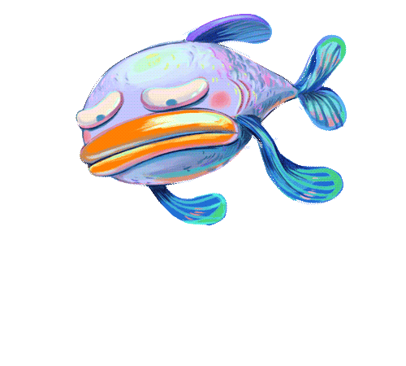

# Портфолио.
## Эпиграф.
***
В данном портфолио собраны лучшие мои проекты на разных языках програмирования и профессиональные навыки. Да, я *универсальный солдат*, можно сказать ***машина*** программирования.
***
# Основная часть.


## Java
```
class HelloWorld {
    public static void main(String[] args) {
        System.out.println("Hello, World!");
    }
}
```
## C 
 ```                                     
#include <stdioh>                    
int main()
{
  printf("Hello, World!\n");
  return 0;
}
```

## C++
```
#include <iostream>
using namespace std;
int main() 
{
    cout << "Hello, World!";
    return 0;
}
```
## Python
 ```
print("Hello, World!")
```
## С#
```
using System;
 
namespace HelloWorld
{
    class Hello 
    {
        static void Main() 
        {
            Console.WriteLine("Hello World!");
        }
    }
}
```
>В конце портфолио, хочется вспомнить слава писателя Томаса Карлейлья
  >>Самый несчастный из людей тот, для кого в мире не оказалось работы.
  
  
### Контакты для связи:
**тел**: ~~+7926567444~~ 8800-555-35-35 проще позвонить чем у кого-то занимать.\
**email**: [nepishiYaVsePoimySama@yandex.ru](http://www.letters.kremlin.ru/letters/send)


## Я жду звонка
